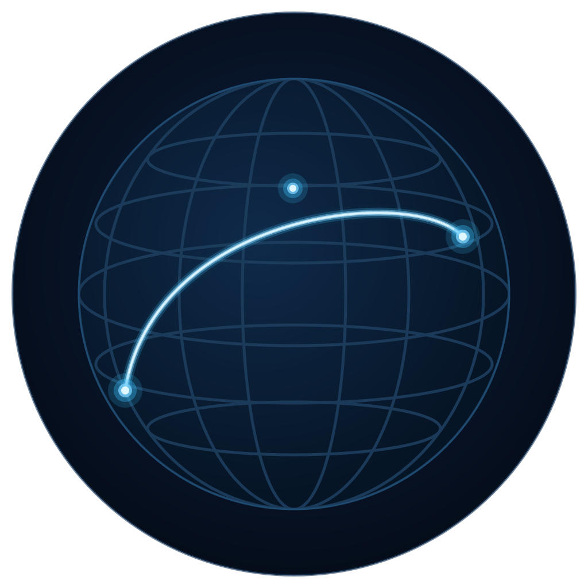

<div align="center">
  <picture>
    <source media="(prefers-color-scheme: dark)" srcset="public/logo.svg"/>
    <source media="(prefers-color-scheme: light)" srcset="public/logo-light.svg"/>
    
  </picture>
  <h1>TraceAtlas</h1>
  <p><strong>Visualize how your internet traffic travels — hop by hop, country by country, across the globe.</strong></p>

  <p>
    
    
    
    
    
  </p>
</div>

---

## Screenshots

> *Screenshots coming soon*

| Landing | Trace in progress | Results |
|---------|------------------|---------|
|  |  |  |

| Hop list | Insights panel | Submarine cables |
|----------|---------------|-----------------|
|  |  |  |

---

## Why Desktop?

Traceroute must run on **your machine** to show your actual network path. A server-side approach traces the server's route, not yours. TraceAtlas is built with **Tauri** — a Rust + OS WebView framework with a ~10–15 MB installer and no bundled Chromium.

| | Tauri (TraceAtlas) | Electron | Web App |
|--|-------------------|----------|---------|
| Installer size | ~10–15 MB | ~150 MB | N/A |
| RAM usage | ~30–60 MB | ~200 MB | N/A |
| Traceroute accuracy | Your path ✅ | Your path ✅ | Server's path ❌ |
| WebView | OS native | Bundled Chromium | Browser |

---

## Features

### Map & Visualization
- Global Leaflet map with dark tile theme
- Animated packet movement along the route (auto-play + step-by-step)
- Curved arc paths between hops — arc height scales with distance
- Glow polyline rendering (multi-layer neon effect)
- Auto-zoom to fit the full route
- Latency heatmap — hop markers colored green → yellow → red
- Submarine cable overlay (708 real cables from TeleGeography, toggle on/off)

### Insights Engine
- **Story** — plain-English summary of the route
- **Country transitions** — every border crossing detected
- **Total distance** — haversine-calculated with fun facts
- **Latency spike detection** — flags jumps > 50ms
- **Bottleneck** — identifies the single slowest hop
- **Ocean crossing heuristic** — country change + distance > 3,000 km

### UI Panels
- **Summary bar** — hops, countries, distance, max latency, source/destination IPs
- **Hop list** — per-hop: number, country flag, IP, org, latency (color-coded)
- **Insights panel** — all insight cards
- Step-by-step hop playback (◀ ▶), replay animation
- Export trace as JSON
- Screenshot capture (PNG)

### Data & Caching
- SQLite database persisted in OS app-data folder
- `ip_cache` — geo results cached 30 days
- `trace_cache` — full trace results cached 1 hour, no repeated traceroutes

---

## How It Works

```
User enters domain / IP
         ↓
Tauri invoke('run_traceroute')
         ↓
Rust executes tracert / traceroute on user's machine
         ↓
JS: parse → filter private IPs → deduplicate hops
         ↓
JS: batch geo-enrich via ip-api.com (SQLite cache)
         ↓
JS: generate insights (rule-based, no AI API)
         ↓
Vue: render map + animation + panels
```

---

## Quick Start

See [docs/SETUP.md](docs/SETUP.md) for full prerequisites and setup.

```bash
# Install dependencies
npm install

# Dev mode (hot-reload)
npm run tauri dev

# Production build (~10–15 MB installer)
npm run tauri build
```

---

## Architecture

```
┌─────────────────────────────────────────┐
│  Vue 3 + Leaflet (WebView renderer)     │
│  • traceroute output parsing            │
│  • geo enrichment (ip-api.com + SQLite) │
│  • insights generation                  │
│  • map rendering + animation            │
├─────────────────────────────────────────┤
│  Tauri Rust layer (~30 lines)           │
│  • run_traceroute → tracert/traceroute  │
│  • @tauri-apps/plugin-sql (SQLite)      │
├─────────────────────────────────────────┤
│  OS WebView — pre-installed, not bundled│
│  Windows: WebView2  macOS: WebKit       │
│  Linux: WebKitGTK                       │
└─────────────────────────────────────────┘
```

---

## Project Structure

```
TraceAtlas/
├── src-tauri/                  ← Rust / Tauri config
│   ├── src/lib.rs              ← run_traceroute command (~30 lines)
│   ├── Cargo.toml
│   ├── tauri.conf.json
│   ├── capabilities/default.json
│   └── icons/                  ← app icons (all platforms)
│
├── src/                        ← Vue 3 frontend
│   ├── lib/
│   │   ├── db.js               ← SQLite via Tauri SQL plugin
│   │   ├── geo.js              ← ip-api.com + SQLite cache
│   │   ├── traceroute.js       ← parsing, dedup, IP filter
│   │   └── insights.js         ← all insight rules
│   └── components/
│       ├── Landing.vue
│       ├── AppView.vue         ← orchestration + toolbar
│       ├── MapView.vue         ← Leaflet map + animation
│       ├── HopList.vue
│       ├── SummaryPanel.vue
│       └── InsightsPanel.vue
│
├── public/
│   ├── logo.svg                ← app logo
│   └── data/cables.geojson    ← 708 TeleGeography submarine cables
│
└── docs/
    ├── SETUP.md
    ├── SPEC_KIT.md
    └── PROJECT_NOTES.md
```

---

## Limitations

- IP geolocation is approximate — city-level accuracy not guaranteed
- Some hops timeout or are hidden by firewalls (`* * *`)
- Undersea cable detection is heuristic (country change + distance > 3,000 km)
- Traceroute path is a snapshot — internet routing changes dynamically
- Not available on mobile (traceroute requires OS-level command execution)

---

## Future Scope

- RIPE Atlas integration — traceroute from probes worldwide
- 3D globe visualization (WebGL / Three.js)
- ASN / ISP graph
- Route anomaly detection
- Real-time latency heatmap over time
- BGP dataset integration

---

## License

MIT © [Krishnendu Ghata](https://github.com/krishghata)

---

<div align="center">
  <sub>Built with Tauri · Vue 3 · Leaflet · Rust · ip-api.com</sub>
</div>
